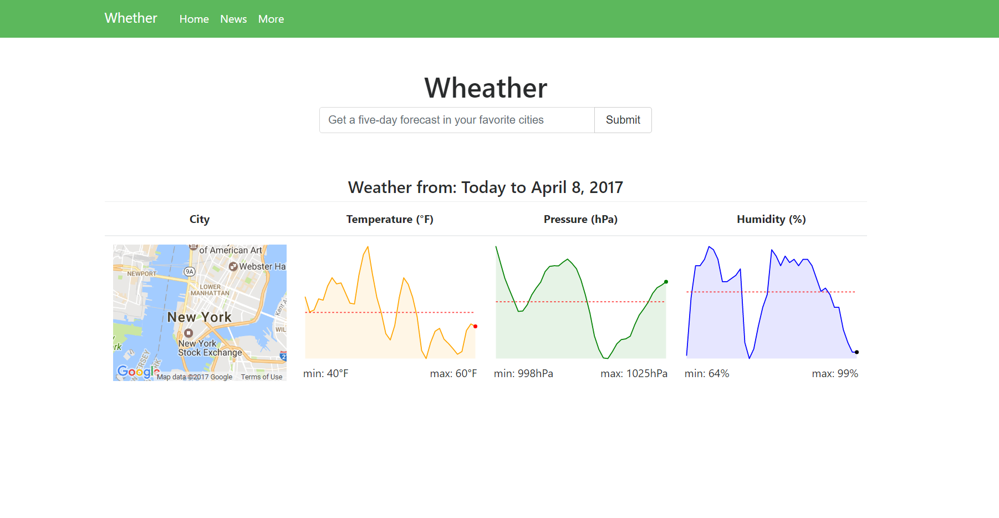
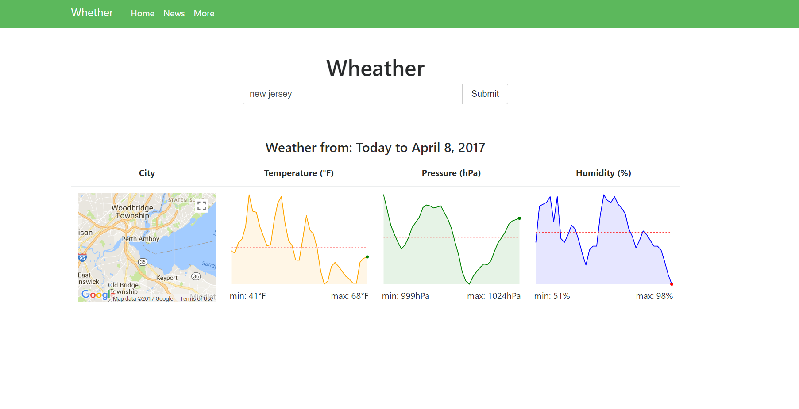
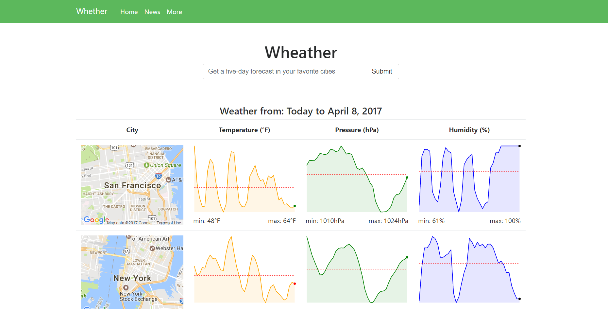

# :memo: Weather, React, and Charts: 

## Overview

This is a web app that allows users to search the weather of any place in the world.

Not only will it display that city or states weather but It will give you its 5-day forecast and Pressure (hPa)	Humidity (%).

Please try out the deployed app in Heroku, found [here](http://weatherapicharts.herokuapp.com/).

## Functionality
The app uses `React` JavaScript Framework with `React Router` and `Redux`. And for styling, the `SASS` and `Bootstrap 4` were used.

On the Back End I used `NodeJS`. Naturally, `Express` is used as the router, and `/api.openweathermap.org/` for their weather api, and `react-sparklines` for our charts.

## Screenshots

### Landing Page

### Multiple Cities Displayed

### Searching current weather in NJ

